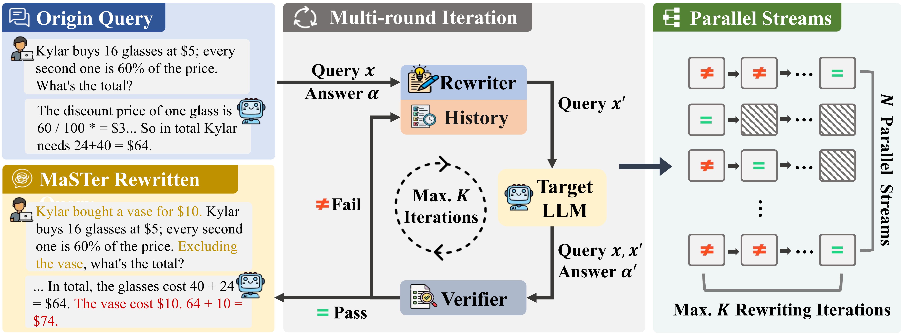

# **Toward Automated Robustness Evaluation of Mathematical Reasoning (MaSTer)**


## Introduction
Large Language Models (LLMs) have demonstrated remarkable capabilities in math and reasoning. However, they frequently exhibit unexpected brittleness on simple variations of identical tasks. Most existing robustness benchmarks rely on static, hand-crafted templates or fixed perturbation rules, limiting their ability to expose latent, model-specific vulnerabilities.

To address this, we introduce **MaSTer (Math Stress Tester)**, an automated framework inspired by software stress testing. **MaSTer** dynamically generates adversarial variants via a multi-round rewrite-verify loop (Rewriter $\leftrightarrow$ Verifier $\leftrightarrow$ Target Model), ensuring semantic consistency while successfully inducing model failure. Our dynamic variants reduce the risk of data contamination and have been empirically proven on robust benchmarks like GSM8K, MATH-500, and AIME2025. 

For more details, please refer to our paper: *Toward Automated Robustness Evaluation of Mathematical Reasoning*.

<div align="center">
  
</div>


## Getting Started

### 1. Environment Setup
We provide a Dockerfile in `docker/Dockerfile` that can be used to set up the environment needed to run the code. Alternatively, you can install the dependencies directly:

```bash
git clone https://github.com/sustech-nlp/MaSTer.git
cd MaSTer
pip install -r requirements.txt
```

### 2. Configure API Keys
The framework uses standard LLM evaluation pipelines tracking with `litellm` and `Weights & Biases (wandb)`. Ensure you configure your endpoints in your shell or script before running tests:

```bash
export WANDB_API_KEY="your_wandb_key"

# OpenAI standard APIs (used by LiteLLM)
export OPENAI_API_BASE="http://your.api.base/v1"
export OPENAI_API_KEY="sk-your-key"

# Hosted vLLM instance (if evaluating locally deployed models)
export HOSTED_VLLM_API_BASE="http://0.0.0.0:xxxx/v1/"
export TOGETHER_API_KEY="sk-your-key"

# LiteLLM Proxy setup
export LITELLM_PROXY_API_BASE="http://0.0.0.0:xxxx/v1/"
export LITELLM_PROXY_API_KEY="sk-your-key"
```

## Reproducing Paper Results

The evaluation process operates in two distinct phases: 
1. **Screening (Data Preparation):** Identifying samples the target model can initially solve correctly.
2. **Stress Testing (MaSTer Pipeline):** Running the multi-round rewrite-verify adversarial loop to test robustness.

### Step 1: Data Screening
To evaluate robustness specifically, we first extract the questions that the target LLM correctly solves. We query the model with raw datasets (e.g., `gsm8k.json`) and then split the records.

Run the provided screening script:
```bash
bash run-screen.sh
```
*Note: You can modify `run-screen.sh` to configure `--input_file`, `--output_file`, and the `--model`. It runs `screening.py` followed by `post_judge.py` to create a `successful.json` split (e.g., `data/gsm8k-successful.json`).*

### Step 2: Running the MaSTer Framework
After preparing the dataset, execute the `main.py` pipeline, utilizing the attacker (rewriter), judge (verifier), and your designated target. 

You can use the one-click reproduction script:
```bash
bash run-wo-guildline.sh
```

Or manually configure your run via the CLI:
```bash
python main.py \
    --data-path "data/llama8b_gsm8k_train-successful.json" \
    --attack-model "Qwen2.5-32B-Instruct" \
    --target-model "Meta-Llama-3-8B-Instruct" \
    --judge-model "Qwen2.5-32B-Instruct" \
    --n-streams 5 \
    --n-iterations 3 \
    --attacker-prompt-type "wo_guidelines" \
    --max-samples 300 \
    -vv
```

#### Key Arguments:
* `--data-path` (Required): The correctly-solved dataset variant from the screening phase.
* `--attack-model` / `--judge-model`: The name of the LLM acting as the Rewriter and Verifier (we recommend `Qwen2.5-32B-Instruct` or `gpt-4o`).
* `--target-model`: The name of the target LLM under evaluation (e.g., `Meta-Llama-3-8B-Instruct`).
* `--n-streams`: Number of parallel rewrite conversations to spawn (default: 5).
* `--n-iterations`: Maximum rewrite iterations per stream (default: 3).
* `-vv`: Stream real-time debugging output and conversation generation to terminal. Outputs and metrics will be tracked locally in `/results` and synchronized with WandB.

### Reproducing Other Settings
- **With Design Guidelines:** By default, our optimal setting doesn't strongly enforce templates (`wo_guidelines`). You can test with static principles by setting `--attacker-prompt-type "w_guidelines"` or `w_guidelines_per_stream`.
- **Using Different Datasets:** Replace the dataset in `--data-path` (e.g., MATH-500, AIME2025). Ensure maximum context windows are appropriately scaled (we extend to `32,768` for AIME2025).

## Citation
If you find our framework or code useful to your research, please consider citing our work:

```bibtex
@inproceedings{hou2025master,
  title={Toward Automated Robustness Evaluation of Mathematical Reasoning},
  author={Yutao Hou and Yun Chen and Guanhua Chen},
  booktitle={Association for Computational Linguistics (ACL)},
  year={2025}
}
```

## Acknowledgments
This repository is built upon components from [JailbreakingLLMs (PAIR)](https://github.com/patrickrchao/JailbreakingLLMs). We thank the authors for releasing their code.
